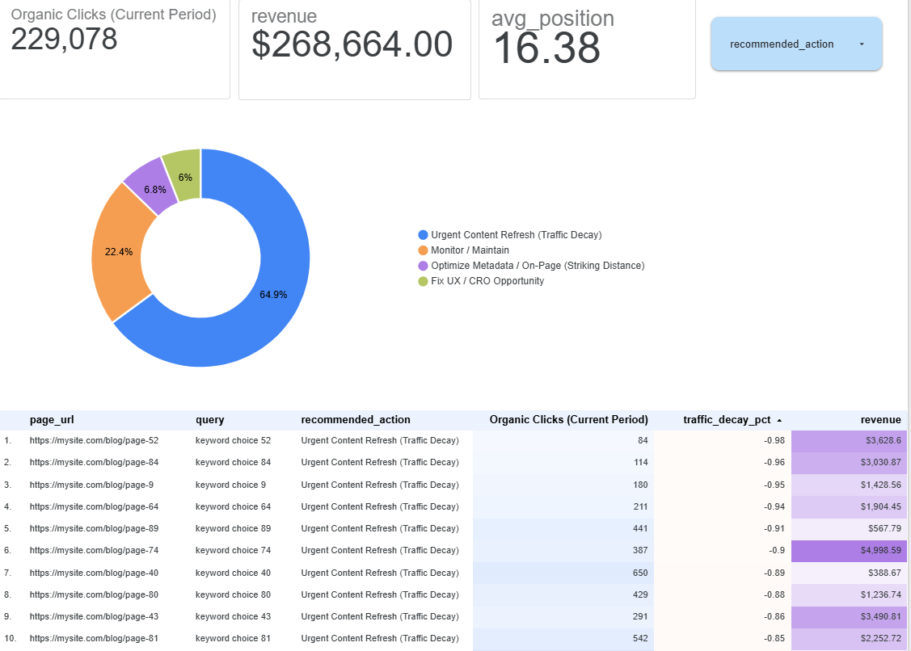

# Automated Search Performance & Content Decay Optimization Pipeline

## Project Overview
In large-scale SEO operations, businesses often struggle to identify why they are losing organic traffic and which pages offer the highest ROI for optimization. 

This project builds an end-to-end data pipeline that automatically ingests raw Google Search Console (GSC) and Google Analytics 4 (GA4) data, standardizes and merges the datasets, performs automated SEO feature engineering, and segments pages into actionable marketing tasks based on performance risk and revenue impact.

## Interactive Dashboard Preview

*An interactive look at the final optimization engine built in Looker Studio.*

---
## Interactive Dashboard
**[Click Here to Launch the Live Interactive Dashboard](https://datastudio.google.com/reporting/efc23afb-2710-40ee-83f6-f2ecb4bb30b8)**

*Click the link above to interact with the live portal, filter by recommended actions, and explore the dataset.*
---

## Tech Stack & Architecture
* **Data Processing & ETL:** Python (`pandas`, `numpy`, `os`)
* **Visualization & Business Intelligence:** Looker Studio
* **Core Methodologies:** Feature engineering, data blending, algorithmic content decay tracking, SEO ranking matrix design.

---

## The Business Logic & Data Rules
Instead of just looking at raw traffic, this pipeline runs every URL through an analytical script to calculate business impact metrics:

1. **Traffic Decay %:** Calculates the percentage change in organic clicks between the current 90 days and the previous 90 days.
2. **Striking Distance Keywords:** Filters keywords ranking on the bottom of page 1 or top of page 2 (Positions 7-15) that require minimal optimization for maximum traffic jumps.
3. **High Intent / Low UX Matrix:** Flags pages with massive organic traffic footprints but conversion rates under 1%, identifying critical Conversion Rate Optimization (CRO) gaps.

### Python Segmentation Snippet:
```python
def assign_seo_action(row):
    if row['traffic_decay_pct'] <= -0.15:
        return 'Urgent Content Refresh (Traffic Decay)'
    elif 7 <= row['avg_position'] <= 15:
        return 'Optimize Metadata / On-Page (Striking Distance)'
    elif row['clicks_current'] > 2000 and row['conversion_rate'] < 0.01:
        return 'Fix UX / CRO Opportunity'
    else:
        return 'Monitor / Maintain'


